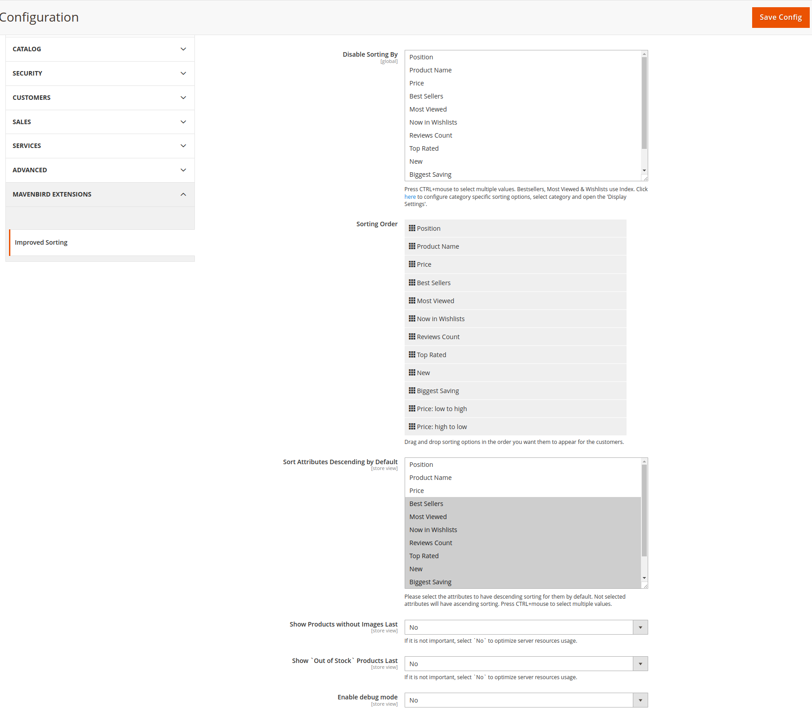
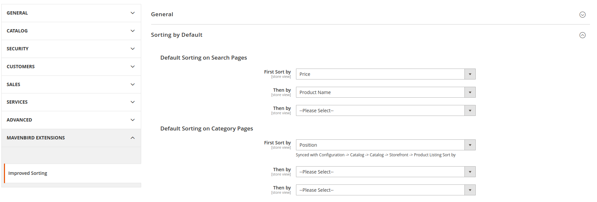
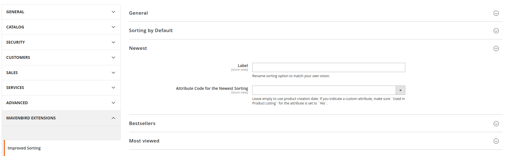
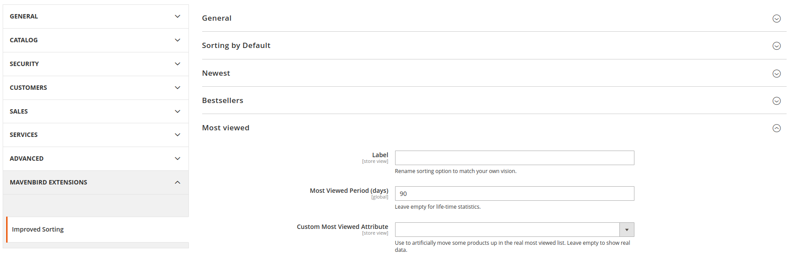
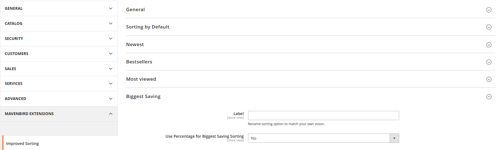
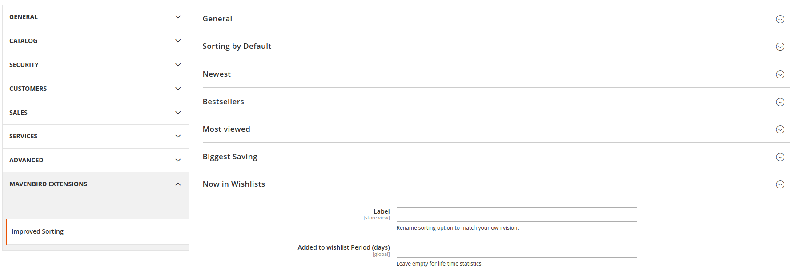
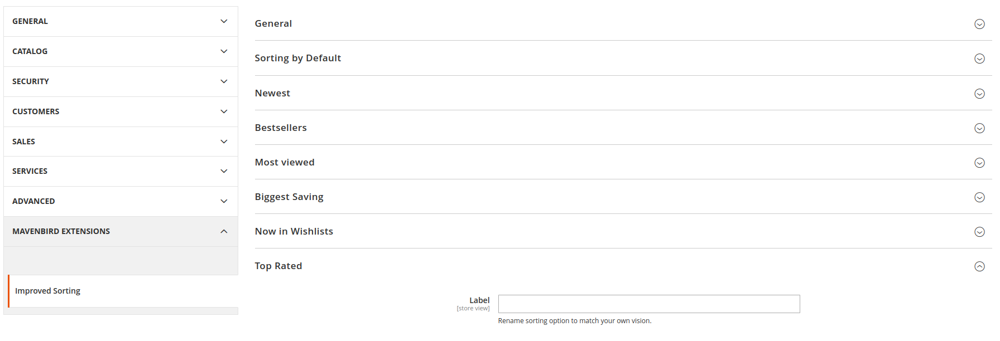
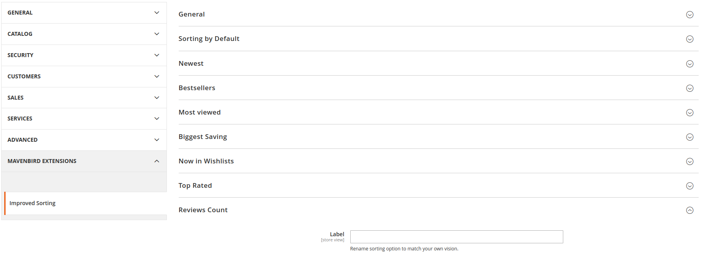
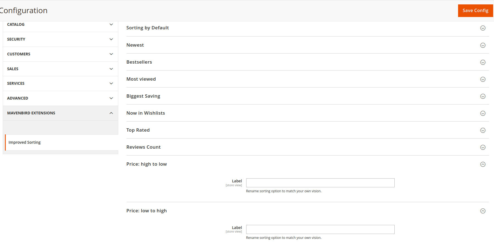
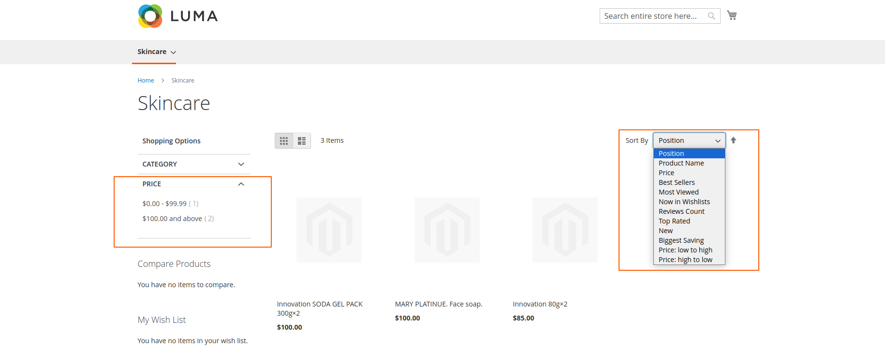

# Magento 2 Sorting Module

Enhance your Magento 2 store with advanced sorting capabilities, providing a better shopping experience for your customers. Our Magento 2 Sorting Module simplifies product sorting, making it easier for merchants to manage product displays and for customers to find what they need.

## Key Features:

- **Advanced Sorting Options:**
Multiple sorting criteria such as price, name, popularity, and ratings.
- **Customizable Sorting Order:**
Tailor the sorting order to highlight specific products.
- **Dynamic Sorting:**
Real-time sorting adjustments without reloading the page.
- **Admin Control:**
Manage and configure sorting options directly from the admin panel.
- **Compatibility:**
Seamlessly integrates with Magento's native product display features.

## Benefits:

- **Improved Customer Experience:**
Allow customers to find products quickly with diverse sorting options.
- **Increased Sales:**
Highlight specific products to drive sales.
- **Easy Management:**
Effortlessly manage sorting options from the admin panel.
- **Flexible Configuration:**
Customize sorting criteria to match your store’s unique requirements.

## Compatibility:
This extension is compatible with Magento 2.4.X (PHP - 8.1 - 8.3) version.

## Installation:
**Install via composer (recommend)** - 

Easy installation process with step-by-step instructions provided for hassle-free setup.
~~~~~~~~~~~~~~~~~~~~~
composer require mavenbird/module-sorting
php bin/magento setup:upgrade
php bin/magento setup:static-content:deploy
php bin/magento setup:di:compile
php bin/magento cache:flush
~~~~~~~~~~~~~~~~~~~~~

## Upgrade/Update Module:
Run the following command in Magento 2 root folder for easy update -
~~~~~~~~~~~~~~~~~~~~~
composer update mavenbird/module-sorting
php bin/magento setup:upgrade
php bin/magento setup:static-content:deploy
php bin/magento setup:di:compile
php bin/magento cache:flush
~~~~~~~~~~~~~~~~~~~~~

## Customization Options:

Adjust the sorting criteria and order to fit your store's needs, ensuring a tailored shopping experience for your customers.

*Configure at Your Ease*

## Support:
Our dedicated support team is available to assist with installation, customization, and any other queries or concerns.
*[support@mavenbird.com](mailto:support@mavenbird.com)*

## Get Started:
Enhance your product sorting capabilities with our Magento 2 Sorting Module. Simplify sorting management, improve customer experience, and streamline your workflows today!

*Thank you!*